# Hi, I'm Adam Harakat 👋

---

### 🚀 About Me

- 🎓 1st-year **Computer Engineering** student at *École Marocaine des Sciences de l'Ingénieur (EMSI), Fès*
- 📊 Focused on **Data Engineering** and **Information Technology**
- 🧠 Analytical mindset with a strong drive to keep learning new tech
- 💻 Comfortable across the stack: **Python (Django/Flask)** on the backend, **HTML/CSS/JS** on the front
- 🌱 Currently leveling up in **Data Science** and **Machine Learning**
- 🗣️ Speak Arabic (native), French & English (intermediate)
- 📫 Reach me at **harakatadam02@gmail.com**

---

### 🛠️ Tech Stack

---

### 📊 GitHub Stats

---

### 📚 What I've Been Up To

- 🐍 Went through **IBM's Python for Data Science** course — NumPy, Pandas, and the data structures behind them
- ☁️ Built no-code ML pipelines with **Azure ML Studio**, from messy data to a deployed model
- 🖥️ Hung out at **Microsoft Tech Day** with Club Data Nexus @ ENSA Fès
- 💡 Teamed up for the **EMSI Fès Hackathon** — creativity, teamwork, and a lot of problem-solving

---

### 📫 Connect with Me

